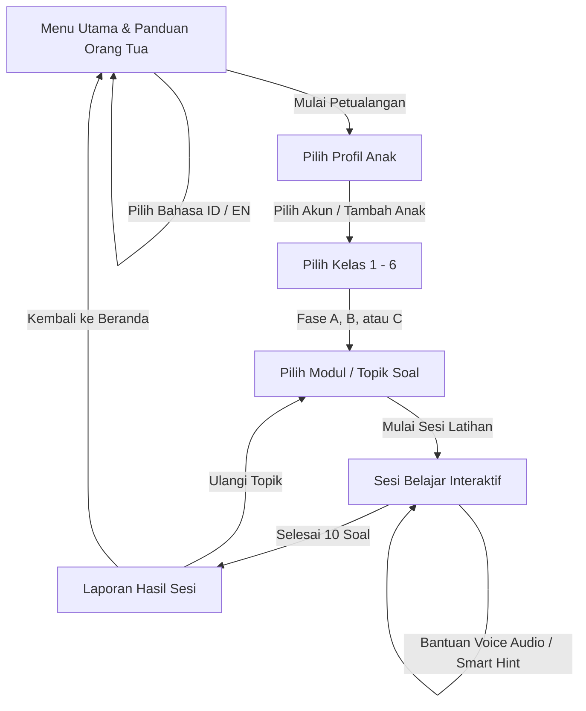

# My Math Journey 🌟
### Petualangan Belajar Matematika SD Interaktif Berbasis Kurikulum Merdeka (Fase A, B, dan C)

**My Math Journey** adalah aplikasi web edukasi interaktif yang dirancang khusus untuk mendampingi siswa Sekolah Dasar (Kelas 1 s/d 6) memahami konsep matematika secara mendalam, visual, dan menyenangkan. Aplikasi ini mengadopsi pendekatan **CPA (Concrete — Pictorial — Abstract)** sehingga anak tidak sekadar menghafal rumus atau menebak pilihan ganda, melainkan membangun intuisi logika matematika melalui manipulatif visual interaktif.

---

## 🌟 Fitur Utama Aplikasi

1. **Dukungan Dwibahasa Penuh (*Bilingual ID / EN*)**
   - Toggle instan antara Bahasa Indonesia (ID) dan Bahasa Inggris (EN) yang dapat diubah kapan saja langsung dari header.
   - Seluruh konten narasi soal cerita, instruksi simulator, petunjuk pintar (*Smart Hints*), tombol aksi, hingga laporan sesi terjemahkan secara kontekstual.
   - Sangat cocok untuk sekolah bilingual, Kurikulum Nasional Plus, maupun pengenalan istilah matematika internasional.

2. **Simulator & Manipulatif Visual Interaktif**
   - **Keranjang Buah (*Fruit Basket*):** Memvisualisasikan konsep penjumlahan dan pengurangan konkret untuk siswa Fase A.
   - **Pecahan Lingkaran (*Circle Fraction*):** Potongan pizza warna-warni untuk memahami pembilang, penyebut, dan pecahan senilai.
   - **Hitungan Bersusun (*Column Arithmetic*):** Melatih perhitungan puluhan bertingkat dengan mini numberpad interaktif dan bantuan nilai tempat (satuan/puluhan).
   - **Pola Bilangan (*Pattern Sequence*):** Simulator deret angka interaktif untuk melatih kepekaan pola lompatan bilangan dan barisan kuadrat.
   - **Penyusun Soal Cerita (*Word Problem Builder*):** Media interaktif di mana anak menyusun kalimat matematika sendiri ($A \times B - C = \text{jawaban}$) sebelum menghitung hasil akhir.
   - **Timbangan Aljabar (*Algebra Balance*):** Menyeimbangkan kedua sisi timbangan untuk menemukan nilai variabel $n$.

3. **Audio Reader / Voice Over Cerdas (Text-to-Speech)**
   - Fitur pembacaan narasi soal ramah anak dalam aksen bahasa Indonesia (`id-ID`) dan bahasa Inggris (`en-US`).
   - **Interupsi Cerdas:** Menekan tombol voice saat suara masih berputar akan seketika menghentikan suara lama dan memulai pembacaan ulang dari awal secara mulus (*no audio overlap*).
   - **Hard Stop Otomatis:** Suara otomatis berhenti seketika saat anak berganti soal, memilih jawaban, membuka konfirmasi keluar, atau berpindah halaman.

4. **Petunjuk Pintar (*Smart Hints*) Tanpa Membocorkan Jawaban**
   - Memberikan scaffolding logika berpikir langkah demi langkah tanpa langsung memberikan jawaban final, melatih kemandirian anak dalam memecahkan masalah.

5. **Laporan Sesi & Deteksi Miskonsepsi Otomatis**
   - Menganalisis pola kekeliruan anak secara mendalam (misal: salah hitung selisih 1 angka, lupa menyimpan puluhan, pembalikan pembilang-penyebut).
   - Memberikan catatan apresiasi bintang dan rekomendasi konkret untuk orang tua/guru.

---

## 🧭 Alur Penggunaan Aplikasi (*Application Flow*)



### 1. Halaman Beranda (Menu Utama)
* Memilih preferensi bahasa (ID / EN) pada header.
* Membuka panduan komprehensif orang tua melalui tombol **Panduan Orang Tua** di footer.
* Menekan tombol **Mulai Petualangan** untuk memulai perjalanan belajar.

### 2. Pemilihan Profil Belajar
* Mendukung multi-profil anak dalam satu perangkat keluarga tanpa perlu registrasi rumit.
* Menampilkan avatar ceria, nama panggilan anak, dan akumulasi bintang yang telah dikumpulkan.
* Data tersimpan aman di penyimpanan lokal peramban (*browser local storage*).

### 3. Pemilihan Kelas (Kelas 1 s/d 6)
* Bebas memilih tingkatan kelas sesuai kesiapan anak (tidak dikunci paksa):
  * **Kelas 1 & 2 (Fase A):** Maskot Anak Ayam & Kucing Kecil.
  * **Kelas 3 & 4 (Fase B):** Maskot Kelinci & Rubah.
  * **Kelas 5 & 6 (Fase C):** Maskot Beruang & Elang.

### 4. Pemilihan Modul Materi (Topik Belajar)
* Menampilkan daftar topik kurikulum yang relevan dengan tingkatan kelas yang dipilih.

### 5. Sesi Belajar Interaktif (*Session Player*)
* **Header Dinamis:** Memuat tombol cepat kembali ke Menu Utama (icon Rumah), tombol ganti topik (icon Buku), progress bar dinamis yang mengisi ruang kosong secara proporsional (`x/10`), serta toggle bahasa dan petunjuk pintar.
* **Kartu Soal:** Soal disajikan dengan tipografi ramah anak dan dilengkapi tombol audio bersuara.
* **Simulator:** Anak berinteraksi langsung (memasukkan angka melalui mini pop-up numberpad, mengklik bagian pecahan, atau menyusun kalimat matematika).

### 6. Laporan Hasil Sesi (*Session Report*)
* Perayaan capaian dengan bintang prestasi dan animasi kembang api (*confetti*).
* Rangkuman akurasi, waktu pengerjaan, dan ringkasan topik.
* Bagian khusus **Catatan untuk Orang Tua** yang menguraikan letak miskonsepsi dan saran pendampingan berikutnya.

---

## 👨‍👩‍👧‍👦 Panduan untuk Orang Tua & Pendidik (*Parent's Companion Guide*)

Matematika sering kali dipandang sebagai mata pelajaran yang menakutkan jika hanya diajarkan melalui rumus hafalan dan lembar kerja yang monoton. **My Math Journey** hadir sebagai sarana bermain sambil bernalar. Berikut panduan praktis untuk mendampingi buah hati Anda:

### 1. Pendampingan Sesuai Fase Tumbuh Kembang Anak

#### 🐥 Fase A: Kelas 1 & 2 (Tahap Konkret)
* **Karakteristik:** Anak pada usia 6–8 tahun membutuhkan representasi benda nyata untuk memahami kuantitas.
* **Saran Pendampingan:**
  * Pada modul **Penjumlahan & Pengurangan Dasar**, ajak anak mengamati buah di keranjang (*Fruit Basket*). Tanyakan: *"Ada berapa apel mula-mula? Jika ditambah dua lagi, sekarang jadi berapa?"*
  * Pada modul **Hitungan Dua Digit Bersusun**, ajari anak untuk selalu memulai dari kolom **satuan** (sebelah kanan), baru berpindah ke kolom **puluhan** (sebelah kiri). Biarkan anak menekan kotak tanda tanya (`?`) untuk membuka numberpad mandiri.
  * Berikan apresiasi saat anak berhasil menemukan pola bertambah/berkurang pada modul **Pola Bilangan**.

#### 🐰 Fase B: Kelas 3 & 4 (Tahap Representasional / Bergambar)
* **Karakteristik:** Anak usia 8–10 tahun mulai beralih memahami perkalian sebagai penjumlahan berulang dan pembagian sebagai pembagian rata.
* **Saran Pendampingan:**
  * Pada modul **Pecahan Dasar**, manfaatkan visual lingkaran kue (*Circle Fraction*). Jelaskan bahwa pembilang (angka atas) adalah bagian yang diwarnai/dimakan, sedangkan penyebut (angka bawah) adalah jumlah seluruh potongan kue yang sama besar.
  * Pada modul **Soal Cerita**, minta anak membacakan cerita dengan lantang atau mendengarkan melalui tombol voice, lalu ajak anak menyusun kalimat matematikanya: *"Ada 4 kotak, masing-masing isi 6 donat, berarti kalimat matematikanya $4 \times 6$."*

#### 🦅 Fase C: Kelas 5 & 6 (Tahap Abstraksi & Penalaran Logis)
* **Karakteristik:** Anak usia 10–12 tahun dipersiapkan untuk berpikir aljabar, perbandingan proporsional, dan konversi pecahan bertingkat.
* **Saran Pendampingan:**
  * Pada modul **Pecahan Campuran & Persen**, diskusikan makna persen sebagai "per seratus".
  * Pada modul **Aljabar Dasar**, gunakan analogi timbangan: *"Kedua sisi timbangan harus seimbang. Kalau sisi kiri dikurangi 5, sisi kanan juga harus diapakan?"*
  * Pada modul **Perbandingan & Soal Cerita Lanjut**, latih anak menemukan faktor pengali sebelum menghitung jawaban akhir.

---

### 2. Membaca & Memanfaatkan Deteksi Miskonsepsi
Pada akhir setiap sesi belajar, aplikasi menyajikan diagnosis miskonsepsi jika anak memilih jawaban yang keliru:
* **"Off-by-one count":** Anak keliru menghitung selisih 1 angka saat mencacah maju atau mundur. Ajak anak menunjuk layar satu per satu dengan jari.
* **"Lupa Menyimpan / Meminjam":** Pada penjumlahan/pengurangan bersusun, ingatkan prinsip nilai tempat saat hasil penjumlahan satuan melebihi 9.
* **"Pembalikan Pembilang-Penyebut":** Ingatkan kembali bahwa bagian yang diwarnai selalu berada di posisi atas.

> **Tips Parenting:** Hindari memarahi anak saat salah. Katakan: *"Tidak apa-apa, yuk kita lihat petunjuk pintar (*Smart Hint*) dan cari tahu kenapa jawabannya begitu!"*

---

### 3. Mengoptimalkan Fitur Voice Audio untuk Pembelajar Auditori & Bilingual
* Bagi anak yang belum lancar membaca kalimat panjang, dorong mereka menekan tombol speaker di samping soal.
* Gunakan mode bahasa Inggris (**EN**) sesekali untuk melatih kemampuan menyimak (*listening*) dan memperkaya kosakata matematika bahasa Inggris anak secara natural (*"plus", "minus", "divided by", "ratio", "fraction"*).

---

## 📚 Matriks Kurikulum & Modul Soal

| Kelas | Fase | Topik Materi Utama | Simulator Interaktif |
| :---: | :---: | :--- | :--- |
| **Kelas 1** | Fase A | • Penjumlahan Dasar<br>• Pengurangan Dasar<br>• Pola Bilangan (+1, +2, +5)<br>• Soal Cerita Konkret ($A \pm B$) | Fruit Basket, Numberpad Mini, Pattern Cards, Word Problem Builder |
| **Kelas 2** | Fase A | • Penjumlahan 2-Digit Bersusun (Tanpa/Dengan Menyimpan)<br>• Pengurangan 2-Digit Bersusun (Tanpa/Dengan Meminjam)<br>• Pola Bilangan ($\pm 2, \pm 3, \pm 5, \pm 10$)<br>• Soal Cerita 2-Digit Perpustakaan & Toko | Column Arithmetic Grid, Numberpad Mini, Pattern Cards, Word Problem Builder |
| **Kelas 3** | Fase B | • Perkalian Tabel Dasar ($2..9$)<br>• Pembagian Tabel Dasar<br>• Pecahan Dasar Visual ($1/2$ s/d $7/8$)<br>• Pola Bilangan Perkalian Berulang<br>• Soal Cerita Wadah & Kelompok ($A \times B \pm C$) | Column Arithmetic, Circle Fraction Pizza, Pattern Cards, Word Problem Builder |
| **Kelas 4** | Fase B | • Pecahan Senilai ($\times 2$ s/d $\times 5$)<br>• Desimal Dasar (Persepuluhan $0,1 - 0,9$)<br>• Pola Bilangan Dua Digit (+12, +15, +20)<br>• Soal Cerita Anggaran & Pembagian ($100 - B \times C$) | Circle Fraction Pizza, Numberpad Mini, Pattern Cards, Word Problem Builder |
| **Kelas 5** | Fase C | • Pecahan Campuran ($A\ b/c \leftrightarrow improper$)<br>• Persen ($25\%, 50\%, 75\%, 20\%$)<br>• Pola Bilangan Geometri ($\times 2$) & Lompatan Ratusan<br>• Soal Cerita Logistik & Pergudangan ($A \times B + C \times D$) | Circle Fraction, Pattern Cards, Word Problem Builder |
| **Kelas 6** | Fase C | • Aljabar Dasar 1 & 2 Langkah ($n \pm a = b$, $an \pm b = c$)<br>• Perbandingan & Rasio Proporsional ($a : b$)<br>• Pola Bilangan Deret Kuadrat & Geometri ($\times 3$)<br>• Soal Cerita Pemodelan Rasio & Transaksi Grosir | Algebra Balance Scale, Circle Fraction, Pattern Cards, Word Problem Builder |

---

## 💻 Panduan Instalasi & Menjalankan Aplikasi

Aplikasi dibangun menggunakan stack web modern:
* **Framework:** [Next.js](https://nextjs.org/) (App Router, Turbopack)
* **Bahasa:** [TypeScript](https://www.typescriptlang.org/)
* **Styling:** [Tailwind CSS](https://tailwindcss.com/) dengan palet warna ramah anak (*Warm Amber, Sky Blue, Soft Cream*)
* **Animasi:** [Framer Motion](https://www.framer.com/motion/)
* **Icon:** [Lucide React](https://lucide.dev/)
* **Audio:** Web Speech API (*Native Browser Text-to-Speech*)

### Langkah Menjalankan Secara Lokal:

1. **Clone repository:**
   ```bash
   git clone https://github.com/sarifmubdijantika/my-math-journey.git
   cd my-math-journey
   ```

2. **Install dependensi:**
   ```bash
   npm install
   ```

3. **Jalankan server pengembangan:**
   ```bash
   npm run dev
   ```

4. Buka peramban di [http://localhost:3000](http://localhost:3000).

---

## 🔒 Privasi & Keamanan Data Anak
* **Tanpa Iklan & Tanpa Pelacak Eksternal:** Aplikasi bersih dari iklan atau pelacakan pihak ketiga yang mengganggu konsentrasi belajar anak.
* **100% Client-Side Local Storage:** Nama profil dan pencapaian bintang disimpan secara lokal di peramban pengguna, menjaga privasi data keluarga Anda seutuhnya.

---
*Dibuat dengan dedikasi untuk generasi cerdas Indonesia yang mencintai matematika.*
