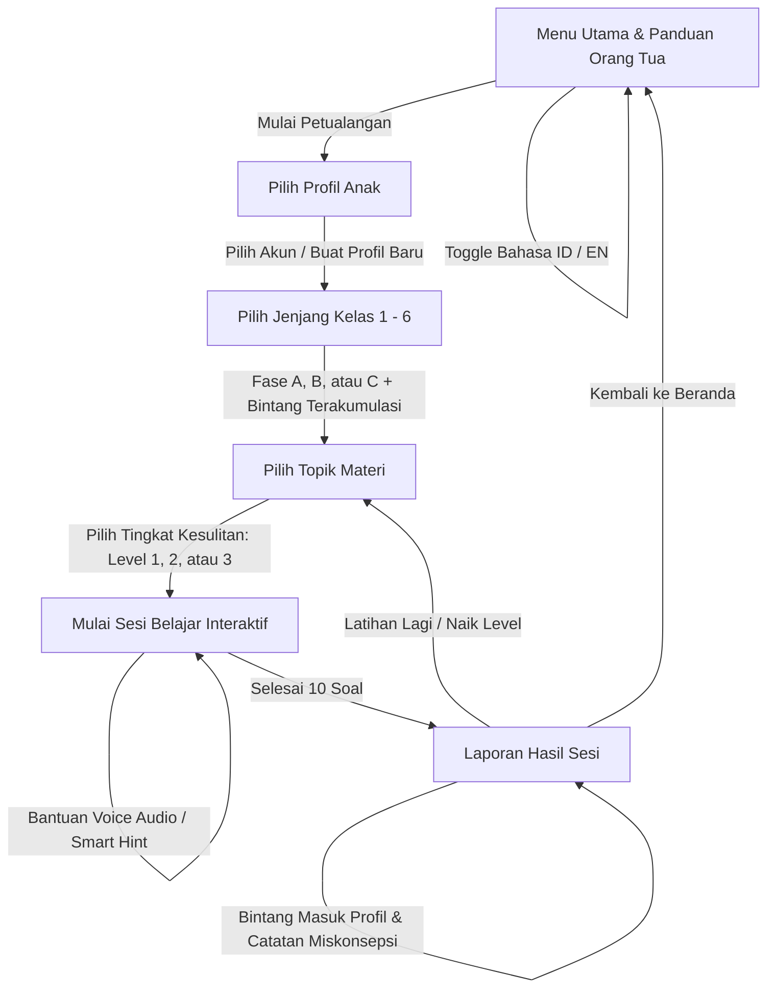

# My Math Journey 🌟
### Petualangan Belajar Matematika SD Interaktif Berbasis Kurikulum Merdeka (Fase A, B, C) & Cambridge Primary Mathematics

**My Math Journey** adalah aplikasi web edukasi matematika interaktif yang dirancang khusus untuk mendampingi siswa Sekolah Dasar (Kelas 1 s/d 6) memahami konsep matematika secara intuitif, visual, mendalam, dan bebas stres. 

Aplikasi ini menyelaraskan capaian **Kurikulum Merdeka (Fase A, B, dan C)** dengan standar internasional **Cambridge Primary Mathematics (Stage 1 – 6)** melalui pendekatan **CPA (*Concrete — Pictorial — Abstract*)**. Anak tidak sekadar menghafal rumus atau menebak pilihan ganda, melainkan bereksplorasi secara aktif melalui simulator interaktif dan manipulatif visual.

---

## 🌟 Fitur Unggulan Terbaru

1. **Kalibrasi Tingkat Kesulitan Berjenjang Penuh (*Comprehensive 3-Tier Difficulty Progression*)**
   - Berlaku untuk **seluruh 21 modul/topik di semua jenjang Kelas 1 s/d 6 SD**:
     - 🟢 **Level 1 — Mudah (*Foundational*):** Fondasi konsep awal, representasi visual konkret, angka terpandu bersih tanpa teknik simpan/pinjam rumit, pecahan satuan ($1/2, 1/3, 1/4$), desimal persepuluhan, persamaan 1 langkah ($n \pm a = b$), rasio sederhana, dan soal cerita 1 langkah langsung.
     - 🟡 **Level 2 — Sedang (*Curriculum Standard*):** Hitung bersusun dengan teknik **simpan (*carry-over*)** dan **pinjam (*regrouping*)**, penyederhanaan pecahan senilai, desimal perseratusan, pecahan campuran dasar, persamaan aljabar 2 langkah ($an \pm b = c$), perbandingan jumlah total, masalah invers luas bangun datar, persen komersial (laba/rugi), deret bertingkat (+2, +3, +4...), dan bilangan kubik ($n^3$).
     - 🔴 **Level 3 — Tantangan (*Enrichment & Olympiad Prep*):**
       - **Operasi Hitung:** Perkalian 2 digit $\times$ 1 digit dan pembagian hasil puluhan ($96 \div 6 = 16, 135 \div 5 = 27$), hitung bersusun simpan/pinjam melintasi 100.
       - **Pecahan & Desimal:** Pecahan komplementer menuju 1 utuh ($1 - a/b$), penjumlahan pecahan campuran dengan *regrouping*, pengurangan pecahan campuran dengan meminjam, operasi 3 pecahan, dan desimal melewati bilangan bulat ($0,7 + 0,6 = 1,3$).
       - **Aljabar & Rasio:** Aljabar variabel di kedua sisi ($an + b = cn + d$), persamaan dengan tanda kurung distributif $a(n \pm b) = c$, perbandingan selisih kuantitas, dan perbandingan 3 variabel ($A : B : C$).
       - **Teori Bilangan & Geometri:** Faktorisasi prima (pohon faktor: $24 = 2^3 \times 3$), pencacahan bilangan prima dalam rentang, uji keterbagian olimpiade, FPB/KPK 3 bilangan & aplikasi nyata (jadwal lampu berkedip / pembagian bingkisan sama rata), keliling diketahui mencari luas, dan luas persegi diketahui mencari keliling.
       - **Persen Komersial:** Persentase terbalik (mencari harga barang sebelum diskon), diskon bertingkat dengan pajak PPN 10%, dan kalkulasi multi-item.
       - **Pola Bilangan & Soal Cerita:** Soal cerita 4–6 operasi multi-gudang / rekonsiliasi anggaran, deret dua barisan mandiri bersilangan (*interleaved*), deret rekursif olimpiade ($U_n = 2U_{n-1} + 3$), bilangan Mersenne ($2^n - 1$), dan barisan pronik ($n(n+1)$).
   - **Rekomendasi Cerdas:** Sistem otomatis menyarankan *"Naik Level"* di halaman laporan saat akurasi anak mencapai $\ge 85\%$.

2. **Bank Soal Prosedural Acak (*Fresh Endless Questions*)**
   - Setiap sesi menghasilkan variasi kombinasi soal baru secara tak terbatas (*dynamic procedural generator*).
   - Menghilangkan kejenuhan pengulangan soal yang sama dan mendorong pemahaman logika yang sesungguhnya.

3. **Akumulasi Bintang & Tracking Kemajuan Nyata**
   - Bintang yang diraih (1 hingga 3 $\star$ per sesi) kini tersimpan permanen di profil anak.
   - **Total Bintang Profil:** Ditampilkan pada pill avatar di header atas.
   - **Bintang per Jenjang Kelas:** Akumulasi capaian bintang tercatat langsung di setiap kartu jenjang kelas (Kelas 1 s/d 6) untuk merayakan konsistensi belajar anak.

4. **Penyelarasan Modul Baru Cambridge Primary Curriculum**
   - **Persen Komersial (*Commercial Percentages*):** Menghitung harga diskon dan persentase laba/rugi dengan konsep rumus papan tulis tanpa membocorkan angka jawaban.
   - **FPB & KPK (*GCF & LCM*):** Penentuan faktor persekutuan terbesar dan kelipatan persekutuan terkecil berbasis visual.
   - **Teori Bilangan (*Number Theory*):** Faktor, kelipatan, dan identifikasi bilangan prima.
   - **Luas & Keliling Bangun Datar (*Area & Perimeter*):** Pemahaman spasial persegi dan persegi panjang.
   - **Operasi Pecahan (*Fraction Operations*):** Penjumlahan dan pengurangan pecahan berpenyebut sama.
   - **Penjumlahan Dua Digit Awal:** Sudah tersedia sejak jenjang Kelas 1 untuk mengakomodasi siswa yang memiliki kesiapan berhitung lebih awal.

5. **Simulator & Manipulatif Visual Presisi**
   - **Hitungan Bersusun Simetris (*True-Center Column Arithmetic*):** Blok angka kalkulasi tersusun presisi di tengah horizontal kartu, dengan tanda operasi hitung ($+$, $-$, $\times$, $\div$) menempel sejajar di ujung garis pembagi tanpa menggeser simetri angka.
   - **Pecahan Lingkaran Bersih (*Circle Fraction*):** Potongan fraksi lingkaran dengan jumlah irisan yang proporsional dan mudah dihitung.
   - **Keranjang Buah (*Fruit Basket*):** Memvisualisasikan kuantitas penjumlahan dan pengurangan konkret untuk siswa Fase A.
   - **Penyusun Soal Cerita (*Word Problem Builder*):** Anak menyusun sendiri kalimat matematikanya ($A \times B - C = \text{jawaban}$) sebelum menentukan hasil akhir.
   - **Timbangan Aljabar (*Algebra Balance*):** Menyeimbangkan kedua sisi timbangan untuk memecahkan nilai variabel $n$.
   - **Pola Bilangan (*Pattern Sequence*):** Simulator deret lompatan angka dan barisan bilangan kuadrat.

6. **Dukungan Dwibahasa Penuh (*100% Bilingual ID & EN*)**
   - Tombol toggle instan (ID / EN) di header.
   - Seluruh konten narasi soal cerita, petunjuk pintar, instruksi simulator, topik kurikulum, laporan evaluasi, hingga diagnosa miskonsepsi orang tua terjemahkan secara kontekstual.

7. **Voice Over / Audio Reader Cerdas (Text-to-Speech)**
   - Pembacaan soal ramah anak dengan aksen natural bahasa Indonesia (`id-ID`) dan bahasa Inggris (`en-US`).
   - **Interupsi Mulus:** Menekan tombol voice saat audio masih berputar akan seketika menghentikan suara lama dan memulai suara baru secara rapi (*no audio overlap*).
   - **Hard Stop Otomatis:** Suara otomatis berhenti saat anak berpindah soal, memilih jawaban, membuka modal konfirmasi keluar, atau berpindah halaman.

8. **Petunjuk Pintar (*Smart Hints*) Konseptual**
   - Memberikan bimbingan strategi logika dan rumus langkah-demi-langkah tanpa membocorkan angka jawaban akhir, melatih kemandirian bernalar.

---

## 🧭 Alur Penggunaan Aplikasi (*Application Flow*)



1. **Halaman Beranda:** Memilih preferensi bahasa (ID/EN) dan membaca panduan orang tua.
2. **Profil Belajar:** Mendukung multi-profil anak dalam satu gawai tanpa registrasi email/password. Menampilkan akumulasi total bintang yang diraih.
3. **Pilih Kelas (1–6) & Kelas Mahir Hitungan:** Bebas memilih kelas sesuai fase kesiapan anak, atau memilih **⚡ Kelas Mahir Hitungan (Speed Math Masterclass)** untuk tutorial jurus trik visual hitung cepat.
4. **Pilih Topik & Tingkat Kesulitan:** Memilih materi yang ingin dilatih serta menentukan level tantangan (**Level 1: Mudah**, **Level 2: Sedang**, atau **Level 3: Tantangan**).
5. **Sesi Latihan (10 Soal):** Mengerjakan soal interaktif dengan bantuan simulator manipulatif visual (Bingkai Sepuluh, Pohon Faktor, Model Tangga Sengkedan FPB/KPK, Diagram Pecahan, Timbangan Aljabar, dll.), mini numberpad, dan audio pembaca soal.
6. **Laporan Sesi & Deteksi Miskonsepsi:** Merayakan keberhasilan dengan animasi confetti, menyimpan perolehan bintang ke profil anak, serta membaca telaah miskonsepsi untuk orang tua/pendidik.

---

## ⚡ Modul Khusus: Kelas Mahir Hitungan (*Speed Math Masterclass*)

Berdasarkan referensi kurikulum **Panduan Hitung Cepat Matematika SD**, modul ini dirancang khusus bukan sebagai bank soal biasa, melainkan **panduan tutorial interaktif langkah demi langkah (*case-by-case guideline*)** dengan visualisasi CPA (*Concrete-Pictorial-Abstract*):

1. **Modul 1: Fondasi Bilangan Cacah (Fase A / Kelas 1–2):**
   * *Pasangan Sahabat 10 (Friends of 10)* dengan Bingkai Sepuluh (*Ten-Frames 5×2*).
   * *Lompatan Melampaui 10 (Bridging Through 10)* memecah bilangan kedua untuk mendarat mulus di angka 10 ($8 + 5 = 8 + 2 + 3 = 13$).
   * *Near-Doubles (Hampir-Kembar)* mengaitkan dengan fakta kembar terhafal ($6 + 7 = 6 + 6 + 1 = 13$).
   * *Pengurangan Selisih Tetap (Constant Difference)* menghilangkan kerumitan meminjam ($52 - 19 = 53 - 20 = 33$).

2. **Modul 2: Perkalian Mental & Spasial (Fase B / Kelas 3–4):**
   * *Model Area 4 Kuadran* dekomposisi perkalian dua digit ($14 \times 12 = 100 + 40 + 20 + 8 = 168$).
   * *Bagi Dua & Kali Dua (Halving & Doubling)* untuk bilangan genap & kelipatan 5 ($16 \times 35 = 8 \times 70 = 560$).
   * *Jurus Pengali Spesial:* $\times 5$ ($n0 \div 2$), $\times 9$ ($n0 - n$), $\times 11$ (sisipkan jumlah kedua digit di tengah: $53 \times 11 = 583$), $\times 25$ ($n00 \div 4$).

3. **Modul 3: Teori Bilangan: KPK & FPB Ramah Anak (Kelas 4–5):**
   * *Metode Tangga / Sengkedan Petak Sawah:*
     * **Konfigurasi Huruf "I" (FPB):** Kalikan seluruh pembagi prima di kolom vertikal kiri.
     * **Konfigurasi Huruf "L" (KPK):** Kalikan pembagi kolom kiri dengan sisa baris alas bawah.
   * *Teorema Emas:* $\text{FPB}(a, b) \times \text{KPK}(a, b) = a \times b$.

4. **Modul 4: Pecahan Acuan & Persentase Kilat (Fase C / Kelas 5–6):**
   * *Bank Pecahan Acuan Mental:* $50\% \leftrightarrow 1/2$, $25\% \leftrightarrow 1/4$, $12.5\% \leftrightarrow 1/8$, $10\% \leftrightarrow 1/10$, $33.3\% \leftrightarrow 1/3$.
   * *Sifat Pertukaran Persen:* $x\%$ dari $y = y\%$ dari $x$ (contoh: $16\%$ dari $50 = 50\%$ dari $16 = 8$).

5. **Modul 5: Pangkat, Kuadrat & Penarikan Akar Cepat (Kelas 5–6 & Olimpiade):**
   * *Kuadrat Bilangan Berakhiran 5:* $a5^2 = [a \times (a + 1)][25]$ (contoh: $35^2 = 1225$, $65^2 = 4225$).
   * *Kuadrat Dekat Basis 50:* $(50 \pm d)^2 = [25 \pm d][d^2]$ (contoh: $53^2 = 2809$).
   * *Tarik Akar Pangkat Tiga dalam 3 Detik (Tirai 3 Digit):* Pemetaan satuan unik ($2 \leftrightarrow 8, 3 \leftrightarrow 7$, lainnya tetap).

6. **Modul 6: Analisis Lanjut & Olimpiade (OSN & SASMO):**
   * *Misteri Bilangan $1001 = 7 \times 11 \times 13$* & sifat pengulangan $abcabc$.
   * *Penjumlahan Deret Simetris Gauss (Metode Lipat Pita):* $1 + 2 + \dots + 100 = 50 \times 101 = 5050$.
   * *Deret Teleskopik Efek Domino:* $\frac{1}{n(n+1)} = \frac{1}{n} - \frac{1}{n+1}$.

---

## 👨‍👩‍👧‍👦 Panduan untuk Orang Tua & Pendidik (*Parent's Companion Guide*)

Matematika adalah cara berpikir logis dan pemecahan masalah, bukan sekadar kecepatan berhitung atau menghafal rumus. Berikut panduan mendampingi buah hati Anda:

### 1. Pendampingan Sesuai Fase Perkembangan Anak

#### 🐥 Fase A: Kelas 1 & 2 (Tahap Konkret — Sensori Motorik)
* **Karakteristik:** Anak membutuhkan representasi visual konkret untuk mengaitkan angka dengan objek nyata.
* **Saran Praktis:**
  * Pada **Penjumlahan & Pengurangan Dasar**, ajak anak mengamati animasi buah di keranjang (*Fruit Basket*). Tanyakan: *"Mula-mula ada berapa buah? Ketika diambil 2, berapa sisanya?"*
  * Pada **Penjumlahan & Pengurangan Dua Digit Bersusun**, bimbing anak untuk selalu mengerjakan kolom **satuan** (kanan) terlebih dahulu, baru kolom **puluhan** (kiri).
  * Pada **Level 2 (Sedang)**, perkenalkan konsep **simpan puluhan (*carry-over*)** jika satuan $\ge 10$, dan konsep **pinjam (*regrouping*)** saat angka atas lebih kecil daripada angka bawah.
  * Pada **Soal Cerita Level 2**, ajak anak memahami penambahan/pengurangan berturut-turut 3 langkah ($A + B + C$ atau $A - B - C$).

#### 🐰 Fase B: Kelas 3 & 4 (Tahap Representasional & Konseptual)
* **Karakteristik:** Anak mulai beralih ke perkalian tabel, pembagian rata, pecahan senilai, dan pemahaman faktor bilangan.
* **Saran Praktis:**
  * Pada materi **Pecahan Dasar & Pecahan Senilai**, gunakan analogi potongan kue pizza (*Circle Fraction*). Tekankan bahwa pembilang (atas) adalah bagian yang diwarnai/dimakan, sedangkan penyebut (bawah) adalah total seluruh irisan yang sama besar.
  * Pada **Teori Bilangan**, ajak anak mencari pasangan faktor bilangan dan mengenali bilangan prima sebagai bilangan yang hanya bisa dibagi 1 dan dirinya sendiri.
  * Pada **Luas & Keliling**, diskusikan perbedaan luas (jumlah petak di dalam) dan keliling (jarak mengelilingi tepi bangun).

#### 🦅 Fase C: Kelas 5 & 6 (Tahap Abstraksi & Pemodelan Masalah)
* **Karakteristik:** Anak dipersiapkan untuk berpikir aljabar, perbandingan proporsional, dan matematika terapan komersial.
* **Saran Praktis:**
  * Pada materi **Persen Komersial**, diskusikan kasus sehari-hari saat berbelanja: *"Jika ada diskon 20%, artinya harga yang kita bayar adalah $(100\% - 20\%) = 80\%$ dari harga aslinya."*
  * Pada materi **Aljabar Dasar**, gunakan analogi timbangan seimbang: *"Jika sisi kiri ditambah 5, maka sisi kanan juga harus ditambah 5 agar timbangan tetap seimbang."*
  * Pada **FPB & KPK**, latih anak membedakan kapan menggunakan FPB (membagi sama banyak ke dalam bingkisan) dan KPK (menentukan jadwal berulang secara bersamaan).

---

### 2. Membaca & Memanfaatkan Deteksi Miskonsepsi
Pada halaman akhir sesi latihan (*Session Report*), buka menu **Detail untuk Orang Tua / Guru** untuk melihat diagnosa kesalahan belajar anak:
* **"Lupa Menyimpan / Lupa Meminjam" (*carry-omitted / borrow-not-applied*):** Ingatkan anak mengenai nilai tempat puluhan saat hitung bersusun.
* **"Tertukar Pembilang & Penyebut" (*numerator-denominator-swap*):** Ingatkan kembali bahwa bagian yang diwarnai selalu di atas.
* **"Tertukar FPB dan KPK" (*lcm-gcd-inverted*):** FPB mencari pembagi terbesar, KPK mencari kelipatan persekutuan terkecil.
* **"Lupa Mengurangkan Diskon" (*discount-subtraction-omitted*):** Nilai diskon adalah potongan harga, bukan harga akhir yang harus dibayar.

> **Prinsip Parenting Positif:** Jangan pernah memarahi anak saat jawabannya salah. Di My Math Journey, kesalahan adalah peta petunjuk yang menunjukkan konsep mana yang perlu diperkuat kembali.

---

### 3. Rutinitas 10–15 Menit & Apresiasi Bintang
* **Cukup 1 Sesi per Hari:** 10 soal sehari (10–15 menit) secara rutin jauh lebih efektif menumbuhkan kepercayaan diri anak daripada belajar berjam-jam sekali seminggu.
* **Rayakan Bintang:** Setiap kali anak menyelesaikan sesi dengan akurasi tinggi, rayakan bintang yang bertambah di kartu kelasnya!

---

## 📚 Matriks Kurikulum & Cakupan Topik Belajar

| Jenjang | Fase | Topik Materi Utama | Penyelarasan Cambridge | Simulator Interaktif |
| :---: | :---: | :--- | :--- | :--- |
| **Kelas 1** | Fase A | • Penjumlahan Dasar<br>• Pengurangan Dasar<br>• Penjumlahan Dua Digit Awal<br>• Pola Bilangan (+1, +2, +5)<br>• Soal Cerita Konkret ($A \pm B$) | Stage 1: Numbers up to 20, concrete addition/subtraction, repeating patterns | Fruit Basket, Mini Numberpad, Pattern Sequence, Word Problem Builder |
| **Kelas 2** | Fase A | • Penjumlahan 2-Digit (Tanpa/Dengan Simpan)<br>• Pengurangan 2-Digit (Tanpa/Dengan Pinjam)<br>• Perkalian Awal ($\times 2, \times 5, \times 10$)<br>• Pola Bilangan ($\pm 2, \pm 3, \pm 5, \pm 10$)<br>• Soal Cerita 3 Langkah ($A + B + C$, $A - B - C$) | Stage 2: 2-digit column arithmetic, regrouping, 3-step word problems | Centered Column Arithmetic, Mini Numberpad, Pattern Sequence, Word Problem Builder |
| **Kelas 3** | Fase B | • Perkalian Tabel Dasar ($2..9$)<br>• Pembagian Tabel Dasar<br>• Pecahan Dasar Visual ($1/2 - 7/8$)<br>• Operasi Pecahan (+ dan − berpenyebut sama)<br>• Pola Bilangan Perkalian Berulang<br>• Soal Cerita Wadah & Kelompok ($A \times B \pm C$) | Stage 3: Times tables, sharing division, fraction equivalence, unit shapes | Column Arithmetic, Circle Fraction Pizza, Pattern Sequence, Word Problem Builder |
| **Kelas 4** | Fase B | • Pecahan Senilai ($\times 2..\times 5$)<br>• Teori Bilangan (Faktor & Kelipatan Prima)<br>• Luas & Keliling Bangun Datar<br>• Desimal Dasar (Persepuluhan $0,1 - 0,9$)<br>• Pola Bilangan Dua Digit (+12, +15, +20)<br>• Soal Cerita Anggaran & Pembagian | Stage 4: Equivalent fractions, decimals, prime factors, geometric perimeter/area | Circle Fraction Pizza, Mini Numberpad, Pattern Sequence, Word Problem Builder |
| **Kelas 5** | Fase C | • Pecahan Campuran ($A\ b/c \leftrightarrow improper$)<br>• Persen Dasar ($20\%, 25\%, 50\%, 75\%$)<br>• FPB & KPK (Faktor & Kelipatan Persekutuan)<br>• Pola Bilangan Geometri ($\times 2$) & Ratusan<br>• Soal Cerita Logistik & Pergudangan ($A \times B + C \times D$) | Stage 5: GCF/LCM, mixed fractions, percentages, multi-step word problems | Circle Fraction Pizza, Pattern Sequence, Word Problem Builder |
| **Kelas 6** | Fase C | • Aljabar Dasar Timbangan ($n \pm a = b$, $an \pm b = c$)<br>• Perbandingan & Rasio Proporsional ($a : b$)<br>• Persen Komersial (Diskon & Untung/Rugi)<br>• Pola Deret Kuadrat & Geometri ($\times 3$)<br>• Soal Cerita Pemodelan Rasio & Transaksi Grosir | Stage 6: Algebraic equations, commercial percentages, square numbers, ratios | Algebra Balance Scale, Circle Fraction Pizza, Pattern Sequence, Word Problem Builder |

---

## 💻 Panduan Instalasi & Menjalankan Aplikasi

Aplikasi dibangun menggunakan stack web modern:
* **Framework:** [Next.js](https://nextjs.org/) (App Router, Turbopack, Static Export)
* **Bahasa:** [TypeScript](https://www.typescriptlang.org/)
* **Styling:** CSS Modern & Tailwind CSS dengan palet warna ramah anak (*Warm Amber, Sky Blue, Soft Cream, Emerald*)
* **Animasi:** [Framer Motion](https://www.framer.com/motion/) & Canvas Confetti
* **Icon:** [Lucide React](https://lucide.dev/)
* **Audio:** Web Speech API (*Native Browser Text-to-Speech*)
* **State Management:** [Zustand](https://github.com/pmndrs/zustand) dengan persistent local storage

### Langkah Menjalankan Secara Lokal:

1. **Clone repository:**
   ```bash
   git clone https://github.com/SMJ-205/my-math-journey.git
   cd my-math-journey
   ```

2. **Install dependensi:**
   ```bash
   npm install
   ```

3. **Jalankan server pengembangan:**
   ```bash
   npm run dev
   ```

4. Buka peramban di [http://localhost:3000](http://localhost:3000).

5. **Build bundle statis:**
   ```bash
   npm run build
   ```

---

## 🔒 Privasi & Keamanan Data Anak
* **100% Bebas Iklan & Tanpa Pelacak Pihak Ketiga:** Tidak ada iklan komersial maupun tracker eksternal yang mengalihkan perhatian anak.
* **Penyimpanan Lokal Mandiri (*100% Client-Side LocalStorage*):** Seluruh data profil, bintang yang diraih, dan riwayat belajar tersimpan di perangkat pengguna secara privat tanpa memerlukan akun atau server eksternal.

---
*My Math Journey — Mengubah ketakutan matematika menjadi petualangan logika yang menyenangkan!*
